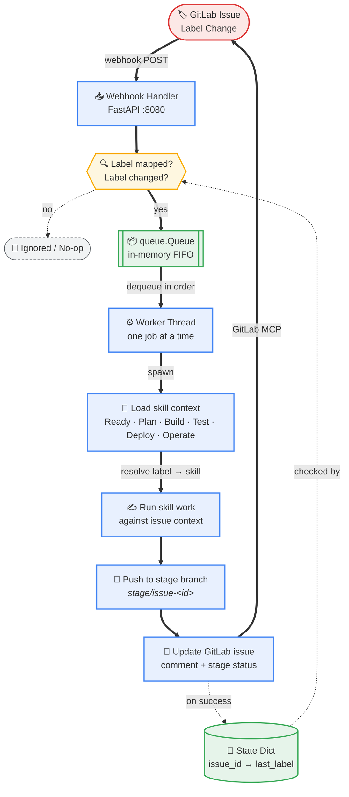

# Orchestrator — Single Process
 

 
**What's in the CLI stage now:**
- **Load skill context** — resolves the current label to its skill config (from `SKILL_MAP`) and loads that skill's context/prompt. One node, six possible skills behind it (Ready, Plan, Build, Test, Deploy, Operate) — which one loads depends on the label, same as your `SKILL_MAP` lookup in code
- **Push to stage branch** — commits land on a branch named by convention, e.g. `plan/issue-123`, `build/issue-123`, so stages don't clobber each other's work
- **Update GitLab issue** — CLI posts a comment (what it did, links to branch/MR) and updates the issue via GitLab MCP, closing the loop back to the board
**Reading the arrows:**
- **Thick colored (`==>`)** — the main execution path, one event flowing end to end
- **Dotted (`-.->`)** — background links: the "no" branch, and state write/read for dedupe
**Flow:**
1. Webhook lands, gets parsed into an `IssueEvent`
2. Checked against `SKILL_MAP` (known label?) and `IssueState` (label actually changed?)
3. If both pass → pushed onto `queue.Queue` (guarantees FIFO order)
4. Single worker thread pulls jobs one at a time → never two CLI runs in parallel
5. State dict only updates **after** a successful run, so a failed job naturally retries next time that label re-fires
**All in one process** — no Redis, no message broker, no DB. State lives in memory and resets on restart (fine unless you need it to survive crashes — if you do later, just flush the dict to a JSON file on `mark_done()`).
 
**Still loosely coupled** where it matters: `SKILL_MAP` is the only thing you touch to add a new label/skill — the queue, state tracking, and worker logic don't change.
 
**Portability**: it's one file + `copilot` CLI as a dependency → drop it in a Dockerfile as-is, runs anywhere.
